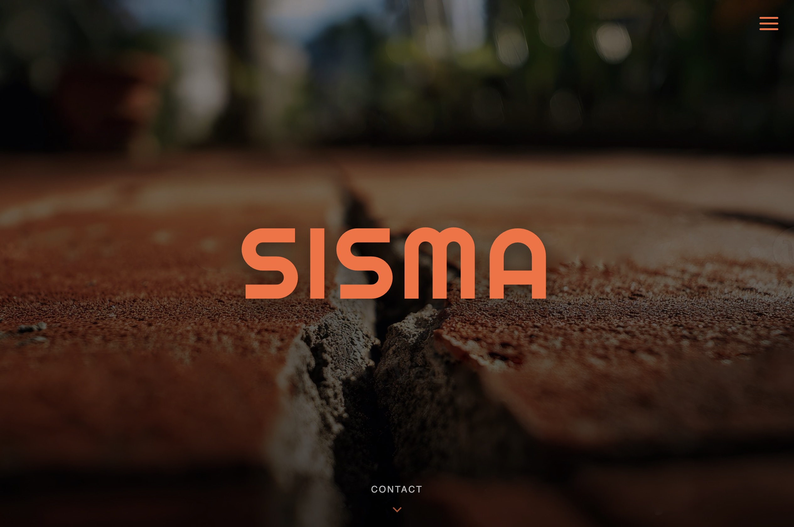
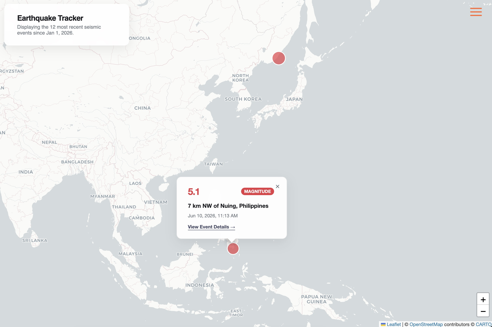
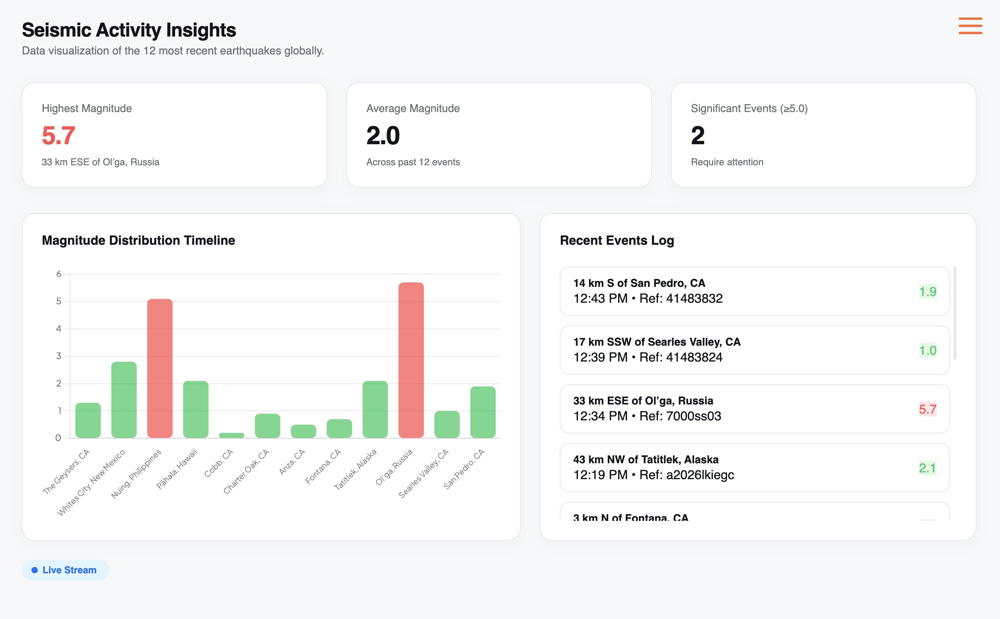

# Sisma

Sito statico per visualizzare informazioni su terremoti recenti a giro nel mondo grazie all'API di USGS.

## 🌐 Live Demo
Il sito è pubblicamente accessibile su GitHub Pages:

[](https://sadsuite.github.io/Sisma/)

## Screenshots


Homepage


Map Page


Data Page   

## Descrizione

Questo progetto è una piccola applicazione web statica che mostra:
- una pagina di presentazione principale (`index.html`)
- una mappa interattiva con gli ultimi eventi sismici (`map.html`)
- una dashboard con statistiche, grafici e feed degli ultimi terremoti (`data.html`)

Il sito usa HTML, CSS e JavaScript vanilla, supportato da librerie esterne come Chart.js, Leaflet e Bootstrap.

## Struttura del progetto
```
.
├── LICENSE
├── README.md
├── assets
│   ├── icons
│   │   └── favicon.svg
│   ├── images
│   │   └── crack.webp
│   └── screenshots
│       ├── data.jpg
│       ├── home.jpg
│       └── map.jpg
├── docs
│   ├── api.md
│   ├── faq.md
│   └── install.md
├── index.html
└── src
    ├── data.json
    ├── index.html
    ├── pages
    │   ├── data.html
    │   └── map.html
    ├── script
    │   ├── data.js
    │   └── map.js
    ├── script.js
    ├── style
    │   ├── data.css
    │   └── map.css
    └── style.css
```

## Come visualizzare il progetto

Vedi la pagina di 👉 [Installazione](/docs/install.md)

### Cartelle principali
- `assets/`: immagini e risorse statiche usate dal sito.
- `docs/`: documentazione aggiuntiva, guide e note di installazione.
- `src/pages/`: pagine HTML del sito.
- `src/style/`: fogli di stile CSS per ogni pagina e stili condivisi.
- `src/script/`: logica JavaScript per le funzionalità comuni e specifiche delle pagine.
- `src/data.json`: file di dati locale utilizzato come fallback per i terremoti.

## Pagine principali

- `src/index.html`: landing page e descrizione del progetto.
- `src/pages/map.html`: visualizzazione mappa con eventi sismici.
- `src/pages/data.html`: dashboard con statistiche, grafici e feed.
- `/index.html`: redirect page per funzionalità GitHub Pages.

## Librerie esterne usate

- `Bootstrap` per alcuni stili e componenti UI.
- `Leaflet` per la mappa interattiva.
- `Chart.js` per i grafici della dashboard.

## Note

- La pagina `map.html` richiede il caricamento della libreria Leaflet e i suoi stili.
- La pagina `data.html` usa Chart.js per visualizzare i grafici.
- Se l'API dei terremoti non è disponibile, il sito mostra un messaggio di avviso e usa i dati locali come fallback.

## 📄 Licenza
Questo progetto è distribuito sotto la **MIT License**.

### Perché questa scelta?
Ho scelto la licenza MIT perché credo nella condivisione aperta del codice, specialmente per progetti didattici. Questa licenza permette ad altri studenti e sviluppatori di:
*   Studiare il codice liberamente.
*   Modificarlo per aggiungere nuove funzionalità (es. nuove città o grafici).
*   Riutilizzarlo nei propri progetti senza barriere legali complesse.

L'unica richiesta è di mantenere l'attribuzione dell'autore originale.   
